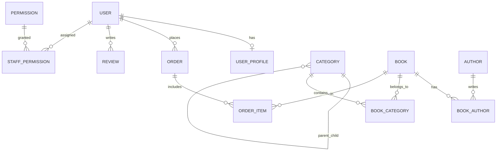

# TỔ SÁCH — TÀI LIỆU TOÀN DIỆN ĐỒ ÁN LIÊN NGÀNH
> **Khẩu hiệu:** *"Sách về tổ, tri thức bay xa"*  
> **Chuyên ngành:** Công nghệ Thông tin  
> **Thời gian bảo vệ dự kiến:** Tháng 10/2026  
> **Tác giả:** Hanh-Dang (hnhngyndng@gmail.com)

---

## 1. Tổng Quan Dự Án & Định Vị Mô Hình

### 1.1 Mục tiêu đề tài
Xây dựng một hệ sinh thái thương mại điện tử chuyên biệt cho ngành sách, giải quyết bài toán trải nghiệm mua sắm trực tuyến chuyên sâu, tinh gọn, tiện dụng cho độc giả và cung cấp công cụ vận hành trực quan, chuẩn chỉ cho nhà quản trị sách.

### 1.2 Mô hình kinh doanh: B2C Thuần Túy (Business-to-Consumer)
* **Bản chất:** Một đơn vị kinh doanh trung tâm (Tổ Sách) trực tiếp nhập, quản lý catalog và phân phối sách tới tay độc giả.
* **Lý do KHÔNG chọn Marketplace (C2C) hay Cho thuê sách:**
  1. **Đảm bảo chất lượng sách:** Khác với sàn C2C dễ gặp sách lậu, sách giả, mô hình B2C giúp nhà sách kiểm soát 100% bản quyền, nguồn gốc NXB chính thống.
  2. **Trải nghiệm khách hàng đồng nhất:** Quản lý tập trung từ khâu đóng gói, vận chuyển đến chăm sóc khách hàng.
  3. **Phù hợp với phạm vi đồ án:** Tập trung làm sâu và hoàn thiện trọn vẹn quy trình bán hàng, thanh toán, quản lý kho và phân quyền nhân viên thay vì dàn trải sang các module phức tạp của sàn đa người bán.

---

## 2. Kiến Trúc Kỹ Thuật (Tech Stack) & Cơ Sở Lựa Chọn

| Thành phần | Công nghệ | Lý do lựa chọn & Điểm mạnh bảo vệ đồ án |
|---|---|---|
| **Fullstack Framework** | **Next.js 15 (App Router)** | Hỗ trợ Server Components giúp tải trang cực nhanh, tối ưu SEO vượt trội cho sản phẩm sách, file-based routing trực quan, tích hợp sẵn API routes và Middleware. |
| **Ngôn ngữ** | **TypeScript** | Định kiểu tĩnh (Static Typing) chặt chẽ, bắt lỗi ngay trong quá trình biên dịch (Compile-time), mã nguồn dễ bảo trì và mở rộng. |
| **Styling** | **Tailwind CSS v4** | Hệ thống Utility-first CSS hiện đại, tối ưu dung lượng bundle, tái sử dụng Design System (`#0B1F3A` - Xanh hải quân, `#F5A623` - Vàng nghệ). |
| **ORM** | **Prisma 6** | Object-Relational Mapping kiểu an toàn (Type-safe), tự động sinh migration, hỗ trợ quan hệ bảng phức tạp, chống triệt để tấn công SQL Injection. |
| **Database** | **PostgreSQL (Supabase Cloud)** | Hệ quản trị cơ sở dữ liệu quan hệ mạnh mẽ, chuẩn ACID, hỗ trợ Transaction, Connection Pooling (PgBouncer) và Full-Text Search. |
| **Xác thực (Auth)** | **Custom JWT + HttpOnly Cookie + Bcrypt** | Cơ chế xác thực phi trạng thái (Stateless), bảo mật cao chống XSS (nhờ HttpOnly cookie) và CSRF (nhờ SameSite lax), mật khẩu được băm bằng thuật toán Bcrypt. |
| **Phân quyền (RBAC)** | **Next.js Proxy / Middleware** | Kiểm tra quyền truy cập route ngay tại tầng rìa mạng (Edge/Proxy), ngăn chặn truy cập trái phép vào trang Admin trước khi trang render. |

---

## 3. Thiết Kế Cơ Sở Dữ Liệu & Phân Quyền (RBAC)

Hệ thống gồm **14 bảng quan hệ** chặt chẽ trong file [`prisma/schema.prisma`](file:///e:/to-sach-studio/prisma/schema.prisma):



### 3.1 Mô hình Phân quyền Người dùng (RBAC)
Proposal quy định chuẩn **3 vai trò**:
1. **`USER` (Khách hàng):** Tìm kiếm sách, xem chi tiết, đánh giá, quản lý giỏ hàng, đặt hàng, theo dõi lịch sử đơn hàng, cập nhật sổ địa chỉ.
2. **`STAFF` (Nhân viên vận hành):** Phân quyền động qua bảng `staff_permissions`. Một nhân viên có thể được cấp 1 hoặc nhiều quyền:
   - `MANAGE_BOOKS`: Thêm/sửa/xóa sách, quản lý tồn kho và giá bìa.
   - `MANAGE_ORDERS`: Tiếp nhận, xác nhận đóng gói và cập nhật vận chuyển đơn hàng.
   - `MANAGE_CATEGORIES`: Quản lý cây phân cấp danh mục 3 tầng.
   - `MANAGE_REVIEWS`: Kiểm duyệt bình luận, đánh giá của khách hàng.
   - `VIEW_AUDIT_LOG`: Theo dõi nhật ký kiểm toán.
3. **`SUPER_ADMIN` (Quản trị viên tối cao):** Toàn quyền hệ thống, quản lý tài khoản nhân viên, cấp phát quyền hạn, xem doanh thu và thống kê.

---

## 4. Nhật Ký Tiến Độ Dự Án (Project Progress)

```
[====== GIAI ĐOẠN 1: NỀN TẢNG ======] ---> HOÀN THÀNH 100%
[== GIAI ĐOẠN 2: FRONTEND & DB ==]   ---> ĐANG THỰC HIỆN (HIỆN TẠI)
[   GIAI ĐOẠN 3: ADMIN & RBAC    ]   ---> CHUẨN BỊ
[   GIAI ĐOẠN 4: TEST & BẢO VỆ   ]   ---> DỰ KIẾN THÁNG 10/2026
```

### Chi tiết các giai đoạn:
* **✅ Giai đoạn 1 — Nền tảng & Cấu trúc (Đã Xong):**
  - Lưu trữ code cũ vào `legacy/`.
  - Khởi tạo Next.js 15 App Router, TypeScript, Tailwind CSS.
  - Thiết kế Schema Prisma 14 bảng chuẩn PostgreSQL.
  - Viết bộ mã hóa Custom JWT Auth & API Login/Register/Logout/Me.
  - Viết Middleware bảo vệ trang Admin và trang cá nhân.
  - Viết `seed.ts` chứa dữ liệu mẫu đầy đủ.
* **⏳ Giai đoạn 2 — Giao diện Khách hàng & Tích hợp DB Thật (Hiện tại):**
  - Nhập Database Password vào `.env` $\rightarrow$ Đẩy bảng lên Supabase (`prisma db push`) $\rightarrow$ Nạp dữ liệu mẫu (`prisma db seed`).
  - Chuyển đổi 11 trang giao diện Khách hàng (Trang chủ, Tìm kiếm, Chi tiết sách, Giỏ hàng, Thanh toán COD/QR ngân hàng, Quản lý đơn hàng cá nhân) từ mock data sang Server Components & Prisma Query.
* **📅 Giai đoạn 3 — Quản trị Nhà Sách & RBAC (Tuần tiếp theo):**
  - Chuyển đổi giao diện Admin Dashboard, Quản lý kho sách (CRUD), Cây danh mục 3 cấp, Xử lý đơn hàng, Phân quyền nhân viên, Nhật ký kiểm toán.
* **📅 Giai đoạn 4 — Tinh chỉnh, Kiểm thử & Đóng gói Báo cáo (Trước giữa tháng 10/2026):**
  - Kiểm thử toàn diện luồng người dùng (E2E Test).
  - Viết tài liệu báo cáo đồ án, slide thuyết trình và chuẩn bị demo bảo vệ.

---

## 5. Bí Kíp Trả Lời Câu Hỏi Hội Đồng Bảo Vệ (Q&A Defense Cheat Sheet)

### Câu 1: Tại sao em chuyển từ mô hình Express + Vite SPA sang Next.js App Router?
> **Trả lời:**  
> *"Dự án sách là một website thương mại điện tử phụ thuộc rất nhiều vào SEO và tốc độ tải trang lần đầu (First Contentful Paint). Vite SPA tải toàn bộ bundle JavaScript về trình duyệt rồi mới render (CSR), dẫn đến bot tìm kiếm (Google) khó lập chỉ mục chi tiết từng cuốn sách và người dùng bị màn hình trắng khi tải mạng chậm.  
> Em chọn Next.js App Router vì tính năng Server Components: toàn bộ dữ liệu sách được truy vấn trực tiếp từ PostgreSQL và render thành HTML tĩnh ngay trên server, tối ưu SEO 100%, bảo mật kết nối Database tuyệt đối và giảm dung lượng tải về máy khách."*

### Câu 2: Cơ chế xác thực (Authentication) của hệ thống hoạt động ra sao?
> **Trả lời:**  
> *"Hệ thống sử dụng Custom JWT kết hợp với HttpOnly Cookie. Khi người dùng đăng nhập, backend kiểm tra mật khẩu bằng thuật toán băm Bcrypt. Nếu đúng, server tạo một mã JSON Web Token (JWT) được ký số bảo mật bằng thư viện `jose` (thuật toán HS256), chứa thông tin định danh và vai trò của user, sau đó gán vào Cookie với cờ `HttpOnly` và `SameSite=Lax`.  
> Cách này vượt trội hơn lưu JWT trong LocalStorage vì ngăn chặn hoàn toàn nguy cơ bị hacker đánh cắp token qua các cuộc tấn công XSS (Cross-Site Scripting)."*

### Câu 3: Làm thế nào để phân quyền nhân viên (RBAC) mà không bị lộ quyền?
> **Trả lời:**  
> *"Hệ thống sử dụng bảo vệ 2 lớp:  
> 1. Lớp ngoài: Next.js Proxy/Middleware giải mã token ngay khi request tới server, lập tức chặn và chuyển hướng nếu vai trò không phải `STAFF` hoặc `SUPER_ADMIN`.  
> 2. Lớp trong: Tại Database, em thiết kế bảng `permissions` và bảng quan hệ `staff_permissions`. Mỗi khi nhân viên thực hiện một tác vụ quản trị (như xóa sách hoặc sửa đơn), server kiểm tra chính xác quyền trong cơ sở dữ liệu trước khi thực thi truy vấn."*
