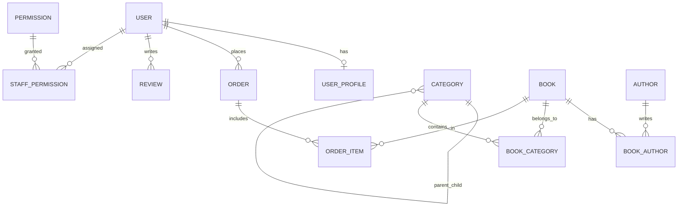

# TỔ SÁCH — TÀI LIỆU TOÀN DIỆN ĐỒ ÁN LIÊN NGÀNH
> **Khẩu hiệu:** *"Sách về tổ, tri thức bay xa"*  
> **Chuyên ngành:** Công nghệ Thông tin  
> **Thời gian bảo vệ dự kiến:** Tháng 10/2026  
> **Tác giả:** Hanh-Dang (hnhngyndng@gmail.com)

---

## 1. Tổng Quan Dự Án & Định Vị Mô Hình

### 1.1 Mục tiêu đề tài
Xây dựng một hệ sinh thái thương mại điện tử chuyên biệt cho ngành sách, giải quyết bài toán trải nghiệm mua sắm trực tuyến chuyên sâu, tinh gọn, tiện dụng cho độc giả và cung cấp công cụ vận hành trực quan, chuẩn chỉ cho nhà quản trị sách.

### 1.2 Mô hình kinh doanh: B2C Thuần Túy (Business-to-Consumer)
* **Bản chất:** Một đơn vị kinh doanh trung tâm (Tổ Sách) trực tiếp nhập, quản lý catalog và phân phối sách tới tay độc giả.
* **Lý do KHÔNG chọn Marketplace (C2C) hay Cho thuê sách:**
  1. **Đảm bảo chất lượng sách:** Khác với sàn C2C dễ gặp sách lậu, sách giả, mô hình B2C giúp nhà sách kiểm soát 100% bản quyền, nguồn gốc NXB chính thống.
  2. **Trải nghiệm khách hàng đồng nhất:** Quản lý tập trung từ khâu đóng gói, vận chuyển đến chăm sóc khách hàng.
  3. **Phù hợp với phạm vi đồ án:** Tập trung làm sâu và hoàn thiện trọn vẹn quy trình bán hàng, thanh toán, quản lý kho và phân quyền nhân viên thay vì dàn trải sang các module phức tạp của sàn đa người bán.

---

## 2. Kiến Trúc Kỹ Thuật (Tech Stack) & Cơ Sở Lựa Chọn

| Thành phần | Công nghệ | Lý do lựa chọn & Điểm mạnh bảo vệ đồ án |
|---|---|---|
| **Fullstack Framework** | **Next.js 15 (App Router)** | Hỗ trợ Server Components giúp tải trang cực nhanh, tối ưu SEO vượt trội cho sản phẩm sách, file-based routing trực quan, tích hợp sẵn API routes và Middleware. |
| **Ngôn ngữ** | **TypeScript** | Định kiểu tĩnh (Static Typing) chặt chẽ, bắt lỗi ngay trong quá trình biên dịch (Compile-time), mã nguồn dễ bảo trì và mở rộng. |
| **Styling** | **Tailwind CSS v4** | Hệ thống Utility-first CSS hiện đại, tối ưu dung lượng bundle, tái sử dụng Design System (`#0B1F3A` - Xanh hải quân, `#F5A623` - Vàng nghệ). |
| **ORM** | **Prisma 6** | Object-Relational Mapping kiểu an toàn (Type-safe), tự động sinh migration, hỗ trợ quan hệ bảng phức tạp, chống triệt để tấn công SQL Injection. |
| **Database** | **PostgreSQL (Supabase Cloud)** | Hệ quản trị cơ sở dữ liệu quan hệ mạnh mẽ, chuẩn ACID, hỗ trợ Transaction, Connection Pooling (PgBouncer) và Full-Text Search. |
| **Xác thực (Auth)** | **Custom JWT + HttpOnly Cookie + Bcrypt** | Cơ chế xác thực phi trạng thái (Stateless), bảo mật cao chống XSS (nhờ HttpOnly cookie) và CSRF (nhờ SameSite lax), mật khẩu được băm bằng thuật toán Bcrypt. |
| **Phân quyền (RBAC)** | **Next.js Proxy / Middleware** | Kiểm tra quyền truy cập route ngay tại tầng rìa mạng (Edge/Proxy), ngăn chặn truy cập trái phép vào trang Admin trước khi trang render. |

---

## 3. Thiết Kế Cơ Sở Dữ Liệu & Phân Quyền (RBAC)

Hệ thống gồm **14 bảng quan hệ** chặt chẽ trong file [`prisma/schema.prisma`](file:///e:/to-sach-studio/prisma/schema.prisma):



### 3.1 Mô hình Phân quyền Người dùng (RBAC)
Proposal quy định chuẩn **3 vai trò**:
1. **`USER` (Khách hàng):** Tìm kiếm sách, xem chi tiết, đánh giá, quản lý giỏ hàng, đặt hàng, theo dõi lịch sử đơn hàng, cập nhật sổ địa chỉ.
2. **`STAFF` (Nhân viên vận hành):** Phân quyền động qua bảng `staff_permissions`. Một nhân viên có thể được cấp 1 hoặc nhiều quyền:
   - `MANAGE_BOOKS`: Thêm/sửa/xóa sách, quản lý tồn kho và giá bìa.
   - `MANAGE_ORDERS`: Tiếp nhận, xác nhận đóng gói và cập nhật vận chuyển đơn hàng.
   - `MANAGE_CATEGORIES`: Quản lý cây phân cấp danh mục 3 tầng.
   - `MANAGE_REVIEWS`: Kiểm duyệt bình luận, đánh giá của khách hàng.
   - `VIEW_AUDIT_LOG`: Theo dõi nhật ký kiểm toán.
3. **`SUPER_ADMIN` (Quản trị viên tối cao):** Toàn quyền hệ thống, quản lý tài khoản nhân viên, cấp phát quyền hạn, xem doanh thu và thống kê.

---

## 4. Nhật Ký Tiến Độ Dự Án (Project Progress)

```
[====== GIAI ĐOẠN 1: NỀN TẢNG (TUẦN 1) ======] ---> HOÀN THÀNH 100% (13/09/2026)
[=== GIAI ĐOẠN 2: FRONTEND & AUTH (TUẦN 2) ==] ---> HOÀN THÀNH 100% (20/09/2026) - MỐC BÁO CÁO 1
[   GIAI ĐOẠN 3: CATALOG & DETAILS (TUẦN 3)  ] ---> CHUẨN BỊ BẮT ĐẦU
[   GIAI ĐOẠN 4: CART & CHECKOUT (TUẦN 4)    ] ---> DỰ KIẾN (MỐC BÁO CÁO 2)
[   GIAI ĐOẠN 5: ADMIN & RBAC (TUẦN 5-6)     ] ---> DỰ KIẾN (MỐC BÁO CÁO 3)
[   GIAI ĐOẠN 6: TEST, DEPLOY & BẢO VỆ (7-8) ] ---> DỰ KIẾN THÁNG 10/2026 (MỐC BÁO CÁO 4)
```

### 4.1 Những gì ĐÃ HOÀN THÀNH trong Giai đoạn 2 (Tuần 2: 14/09 — 20/09/2026):
* [x] **Dọn dẹp kiến trúc:** Chuyển toàn bộ code Express/Vite prototype vào `legacy/` làm tư liệu tham khảo UI/Logic.
* [x] **Khởi tạo Framework chuẩn:** Thiết lập dự án Next.js 15 (App Router, TypeScript, Tailwind CSS v4) tại thư mục gốc.
* [x] **Thiết kế Database chuẩn Proposal:** Xây dựng `prisma/schema.prisma` với đầy đủ 14 bảng quan hệ, Enum phân quyền 3 vai trò (`USER`, `STAFF`, `SUPER_ADMIN`).
* [x] **Kết nối & Đẩy bảng lên Supabase Cloud:** Chạy `npx prisma db push` thành công 100% lên PostgreSQL Supabase Singapore.
* [x] **Nạp dữ liệu mẫu ban đầu (Seed Data):** Viết và chạy `prisma/seed.ts` nạp thành công 6 quyền hạn, 4 tài khoản mẫu (`admin@tosach.vn`, `staff.kho@tosach.vn`, `staff.order@tosach.vn`, `customer@gmail.com`), 8 đầu sách, cây danh mục 3 tầng, tác giả và đơn hàng mẫu.
* [x] **Hệ thống Xác thực (Auth Engine):** Viết `src/lib/auth.ts`, các API route `/api/auth/login`, `/api/auth/register`, `/api/auth/logout`, `/api/auth/me` với JWT mã hóa `jose` và HttpOnly Cookie.
* [x] **Khung Layout Dùng Chung (Storefront Shell):** Dựng `CustomerHeader` (nhận diện auth state, tìm kiếm, giỏ hàng badge), `CustomerFooter` (4 trụ cột cam kết B2C), và `CartContext` (`localStorage` lưu trữ giỏ hàng độc lập cho khách vãng lai).
* [x] **Trang Chủ Kết Nối Database Thật (`src/app/page.tsx`):** Server Component truy vấn dữ liệu trực tiếp qua Prisma ORM, hiển thị Hero Banner, Thể loại nổi bật, Sách bán chạy nhất (`bestsellerBooks`), Sách mới (`newBooks`), và Cam kết chất lượng.
* [x] **Giao Diện Đăng Nhập / Đăng Ký (`src/app/auth/page.tsx`):** Dựng trang Auth hoàn chỉnh hỗ trợ tab Đăng Nhập / Đăng Ký, kết nối API backend thật, hỗ trợ tham số `redirect` thông minh và bộ nút chọn nhanh tài khoản mẫu (Khách hàng, Staff Kho, Staff Đơn, Super Admin) phục vụ chấm điểm đồ án.
* [x] **Phân Quyền Route & Bảo Vệ Chuẩn Hóa Trường Phái 1 (`src/middleware.ts`):**
  - Public routes: `/`, `/catalog`, `/book/*`, `/cart` (cho phép khách vãng lai tự do duyệt và thêm vào giỏ).
  - Protected routes: `/checkout/*`, `/account/*`, `/profile/*` (chặn và chuyển hướng sang `/auth?redirect=...` nếu chưa đăng nhập).
  - Admin routes: `/admin/*` (chặn triệt để, chỉ cho phép `STAFF` và `SUPER_ADMIN`).
* [x] **Kiểm thử biên dịch (Verification):** Kiểm tra `npx tsc --noEmit` đạt 0 lỗi type; build Turbopack `npm run build` thành công 100%.

---

### 4.2 Kế hoạch thực hiện cho TUẦN 3 (Giai đoạn 3: 21/09 — 27/09/2026):
* [ ] **Bước 1 — Trang Tìm Kiếm & Danh Mục (`src/app/catalog/page.tsx`):**
  - [ ] Lọc sách theo Danh mục 3 cấp (L1 - L2 - L3) lấy từ Supabase DB.
  - [ ] Lọc theo khoảng giá bìa và mức đánh giá sao.
  - [ ] Sắp xếp: Bán chạy nhất (`soldCount`), Giá tăng dần, Giá giảm dần, Mới nhất.
  - [ ] Tìm kiếm sách toàn văn theo từ khóa (tiêu đề, tác giả, mô tả).
* [ ] **Bước 2 — Trang Chi Tiết Sách (`src/app/book/[slug]/page.tsx`):**
  - [ ] Dynamic Route hiển thị chi tiết sách theo slug chuẩn SEO.
  - [ ] Thư viện ảnh bìa sách, thông số xuất bản (NXB, số trang, kích thước, định dạng bìa).
  - [ ] Hiển thị danh sách đánh giá đã duyệt từ bảng `reviews`.
  - [ ] Xử lý nút "Thêm vào giỏ" và "Mua ngay" (chuyển tiếp tới `/cart` hoặc `/checkout`).

---

## 5. Bí Kíp Trả Lời Câu Hỏi Hội Đồng Bảo Vệ (Q&A Defense Cheat Sheet)

### Câu 1: Tại sao em chuyển từ mô hình Express + Vite SPA sang Next.js App Router?
> **Trả lời:**  
> *"Dự án sách là một website thương mại điện tử phụ thuộc rất nhiều vào SEO và tốc độ tải trang lần đầu (First Contentful Paint). Vite SPA tải toàn bộ bundle JavaScript về trình duyệt rồi mới render (CSR), dẫn đến bot tìm kiếm (Google) khó lập chỉ mục chi tiết từng cuốn sách và người dùng bị màn hình trắng khi tải mạng chậm.  
> Em chọn Next.js App Router vì tính năng Server Components: toàn bộ dữ liệu sách được truy vấn trực tiếp từ PostgreSQL và render thành HTML tĩnh ngay trên server, tối ưu SEO 100%, bảo mật kết nối Database tuyệt đối và giảm dung lượng tải về máy khách."*

### Câu 2: Cơ chế xác thực (Authentication) của hệ thống hoạt động ra sao?
> **Trả lời:**  
> *"Hệ thống sử dụng Custom JWT kết hợp với HttpOnly Cookie. Khi người dùng đăng nhập, backend kiểm tra mật khẩu bằng thuật toán băm Bcrypt. Nếu đúng, server tạo một mã JSON Web Token (JWT) được ký số bảo mật bằng thư viện `jose` (thuật toán HS256), chứa thông tin định danh và vai trò của user, sau đó gán vào Cookie với cờ `HttpOnly` và `SameSite=Lax`.  
> Cách này vượt trội hơn lưu JWT trong LocalStorage vì ngăn chặn hoàn toàn nguy cơ bị hacker đánh cắp token qua các cuộc tấn công XSS (Cross-Site Scripting)."*

### Câu 3: Làm thế nào để phân quyền nhân viên (RBAC) mà không bị lộ quyền?
> **Trả lời:**  
> *"Hệ thống sử dụng bảo vệ 2 lớp:  
> 1. Lớp ngoài: Next.js Proxy/Middleware giải mã token ngay khi request tới server, lập tức chặn và chuyển hướng nếu vai trò không phải `STAFF` hoặc `SUPER_ADMIN`.  
> 2. Lớp trong: Tại Database, em thiết kế bảng `permissions` và bảng quan hệ `staff_permissions`. Mỗi khi nhân viên thực hiện một tác vụ quản trị (như xóa sách hoặc sửa đơn), server kiểm tra chính xác quyền trong cơ sở dữ liệu trước khi thực thi truy vấn."*

---

## 6. Quy Chuẩn Xây Dựng Giao Diện (UI Implementation Rules)

Để đảm bảo dự án bám sát 100% Proposal B2C và không bị nhầm lẫn giữa mã nguồn thương mại thật với các công cụ kiểm thử, toàn bộ quá trình migrate từ `UI/` và `legacy/` phải tuân thủ nghiêm ngặt bảng phân định sau:

### 6.1 Các thành phần BỎ HOÀN TOÀN (Không code, không tạo route):
* ❌ **Thẻ Banner Kêu gọi Seller / Trở thành người bán:** Mang bản chất marketplace C2C.
* ❌ **Vừa Đăng Bán (Realtime Feed):** Tính năng người dùng cá nhân bán lại sách cũ.
* ❌ **Request Rare Book Banner:** Tính năng tìm sách hiếm từ cộng đồng C2C.
* ❌ **Ô nhập Voucher / Quản lý Voucher:** Proposal B2C tập trung bán trực tiếp, đã lược bỏ hệ thống voucher phức tạp.
* ❌ **Floating AI Chatbot:** Tránh phân tán phạm vi chức năng bắt buộc của đồ án.

### 6.2 Giao diện Thực Tế của Hệ Thống (Production UI):
Toàn bộ mã nguồn sẽ bám sát thiết kế trong `UI/` và tái sử dụng JSX/Tailwind đã dựng sẵn trong `legacy/src/`:
1. **Header & Navigation B2C:** Logo thương hiệu Tổ Sách, ô tìm kiếm sách trực quan, nút Giỏ hàng kèm số lượng badge, Menu Tài khoản (Đăng nhập / Hồ sơ / Đơn mua).
2. **Trang Chủ (`/`):** Hero Banner giới thiệu Tổ Sách, Thống kê nhanh (Micro Stats), Sách Nổi Bật (dựa trên top bán chạy từ DB), Giờ Vàng Giá Tốt (Flash Sale), Mới Lên Kệ, Cây thể loại chính, Footer thương hiệu B2C.
3. **Trang Danh Mục & Tìm Kiếm (`/catalog`):** Bộ lọc danh mục 3 cấp (L1 - L2 - L3), lọc khoảng giá, lọc đánh giá sao, sắp xếp (Bán chạy, Giá tăng/giảm), phân trang hoặc infinite scroll.
4. **Trang Chi Tiết Sách (`/book/[slug]`):** Thư viện ảnh bìa, thông tin xuất bản, tình trạng kho, mô tả nội dung, đánh giá đã kiểm duyệt từ độc giả, nút Mua ngay / Thêm vào giỏ.
5. **Giỏ Hàng & Thanh Toán (`/cart`, `/checkout`):** Xem danh sách sách đã chọn, cập nhật số lượng, form thông tin giao hàng, chọn phương thức COD hoặc Chuyển khoản QR ngân hàng, lưu đơn thật vào DB.
6. **Lịch Sử Đơn Hàng & Hồ Sơ (`/orders`, `/profile`):** Danh sách đơn mua, trạng thái vận chuyển theo timeline, cập nhật địa chỉ giao hàng.
7. **Khu Vực Quản Trị Admin (`/admin`):** Dashboard thống kê doanh thu, Quản lý kho sách (Thêm/Sửa/Xóa/Tồn kho), Quản lý cây danh mục 3 cấp, Xử lý đơn hàng, Phân quyền nhân viên (RBAC), Nhật ký kiểm toán (Audit Logs).

### 6.3 Giao diện Phục Vụ Quá Trình Dev & Kiểm Thử (Testing-Only UI):
Các thành phần này chỉ được phép tồn tại tạm thời trong lúc code và demo kiểm thử, **phải cô lập và gỡ bỏ / tắt khi đóng gói nghiệm thu đồ án**:
* ⚠️ **Dev Role Quick Switcher (Thanh chuyển đổi vai trò nhanh):** Nút bấm hoặc thanh công cụ nổi giúp lập trình viên switch nhanh giữa tài khoản `Khách hàng` $\leftrightarrow$ `Staff Kho` $\leftrightarrow$ `Staff Đơn` $\leftrightarrow$ `Super Admin` mà không phải gõ email/password nhiều lần.
  - *Quy tắc:* Phải được bọc trong điều kiện kiểm tra môi trường:
    ```tsx
    if (process.env.NODE_ENV !== 'production') {
      // Chỉ hiển thị trên localhost trong quá trình dev
    }
    ```
  - *Khi chốt đồ án:* Xóa component này ra khỏi cây giao diện chính để khách hàng chỉ đăng nhập qua trang `/auth` thực tế.
* ⚠️ **Debug Inspector / Dev Badges:** Các badge hiển thị thời gian phản hồi query DB hoặc payload token trên giao diện test.
